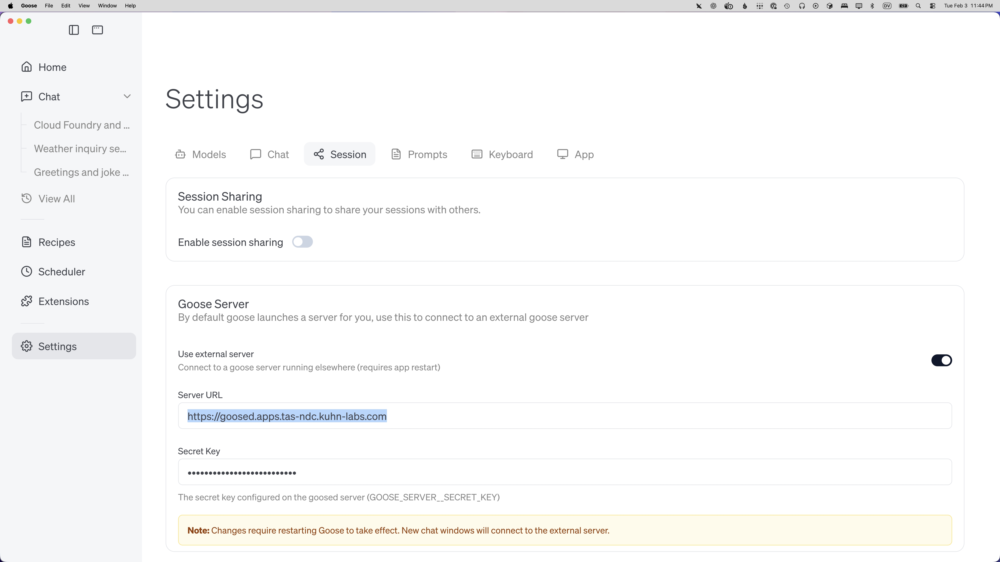
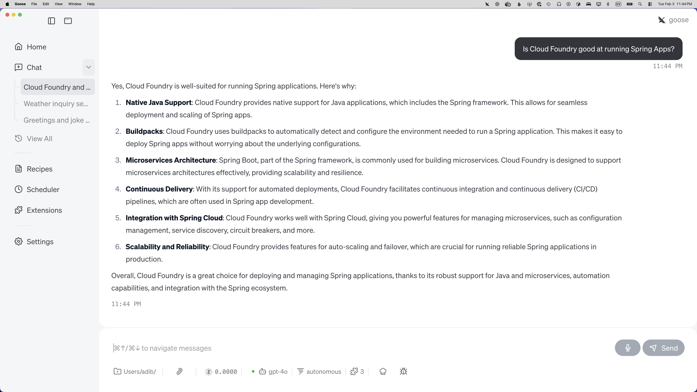

# goose-foundry
Build and deploy `goosed` and the Goose CLI web UI to Cloud Foundry.

**Prereqs**
- Docker (for the CF-compatible build image)
- Cloud Foundry CLI (`cf`)
- `vendir` installed
- `jq` (used by `test.sh`)

**Build environment notes**
- Tested on macOS with Docker Desktop (cross-compiling Linux/amd64 binaries).
- The build can take a while. On an M2 Max with 9GB RAM, it takes ~9 minutes.

**1) Vendor the Goose source**
This repo uses `vendir` to pull `vendor/goose`. Run this first (and re-run after updates).

```bash
vendir sync
```

**2) Build the CF Linux build image**
The `Dockerfile` in this repo builds a Linux/amd64 image aligned with CF (cflinuxfs4 / Ubuntu 22.04). This is used to compile compatible `goosed` and `goose` binaries.

```bash
docker build --platform linux/amd64 -t goose-build:cf .
```

**3) Build `goosed` + `goose` for CF**
This uses the image above and outputs:
- `target/linux-release/release/goosed`
- `target/linux-release/release/goose`

```bash
./build-goose-for-cf.sh
```

**4) Push to Cloud Foundry (goosed)**
The repo includes:
- `apps/goosed/manifest.yml`
- `apps/goosed/Procfile`
- `push-goosed.sh`

Set your API key, then push:

```bash
export OPENAI_API_KEY="..."
./push-goosed.sh
```

**5) Test the deployment**
`test.sh` will discover the route from `apps/goosed/manifest.yml` and the live CF app, then exercise the API.

```bash
./test.sh "Hello, what can you do?"
```

**6) Push the Goose CLI web UI**
This deploys `goose web` as a separate CF app.

```bash
export OPENAI_API_KEY="..."
./push-goosecli.sh
```

**7) Use Goose Desktop with a remote agent**
Install the Goose Desktop app for your OS, then connect it to the Cloud Foundry deployment:

1. Open Goose Desktop → Settings.
2. In **Goose Server**, toggle **Use external server** on.
3. Set **Server URL** to your app URL (for example, `https://<route>`).
4. Set **Secret Key** to the same value as `GOOSE_SERVER__SECRET_KEY`.
5. Restart Goose Desktop.
6. Open a new chat window — it will connect to the remote `goosed` instance.

Screenshots:





**Notes**
- The app reads host/port from `GOOSE_HOST` / `GOOSE_PORT` (not double-underscore).
- `GOOSE_SERVER__SECRET_KEY` is required for auth (double-underscore is correct here).
- Staging directories are `apps/goosed/stage/` and `apps/goosecli/stage/` and are gitignored for demo visibility.
